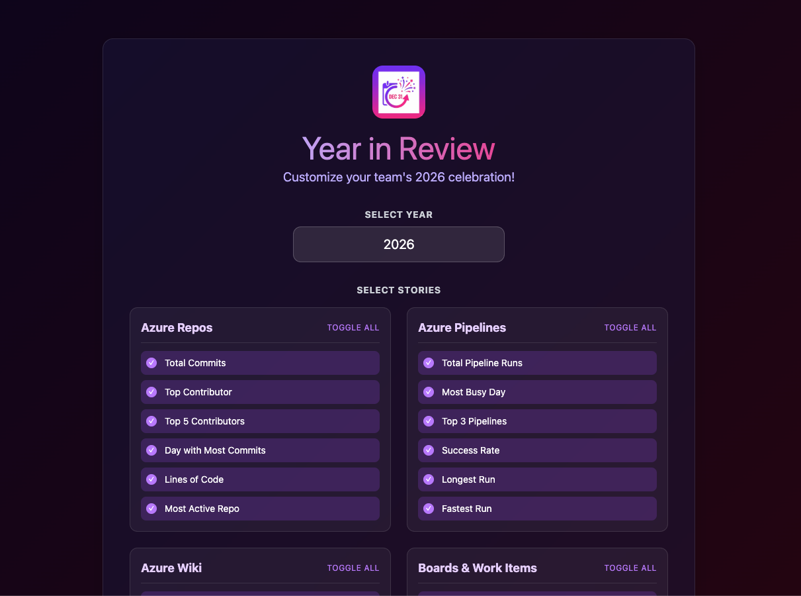
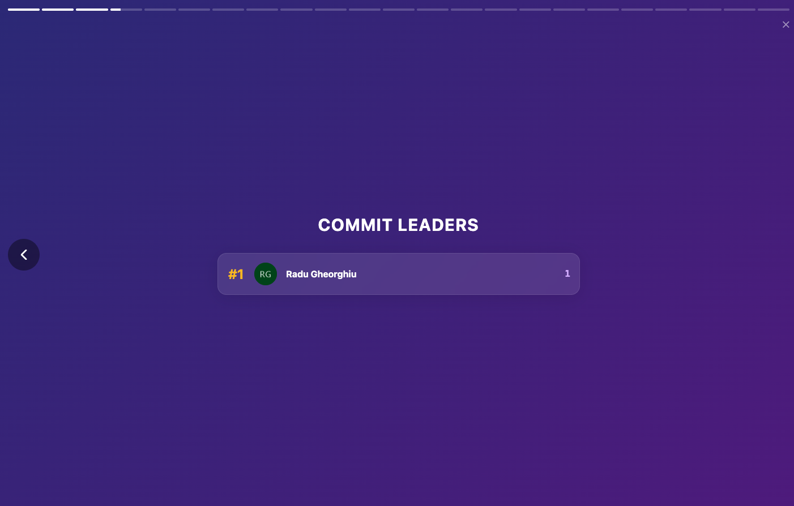
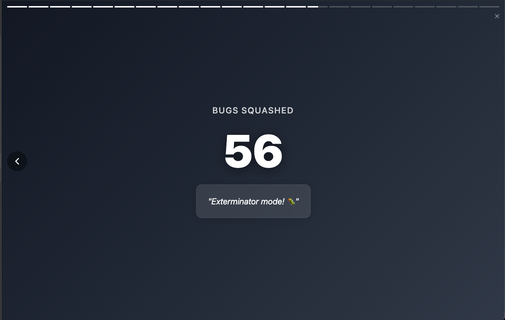
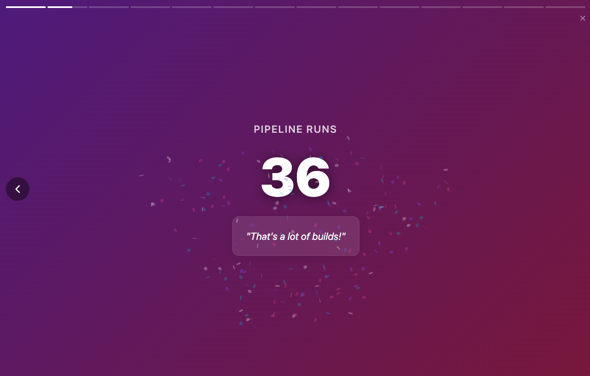
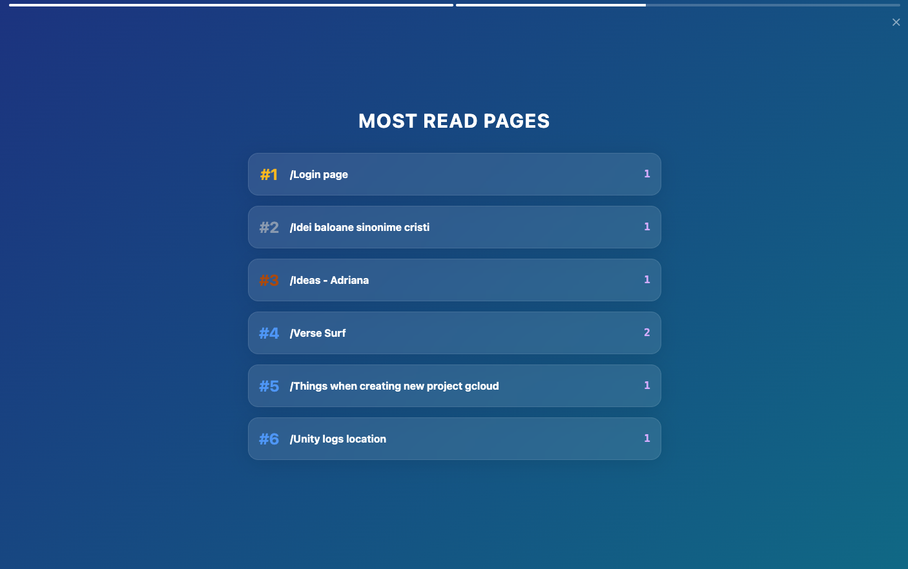
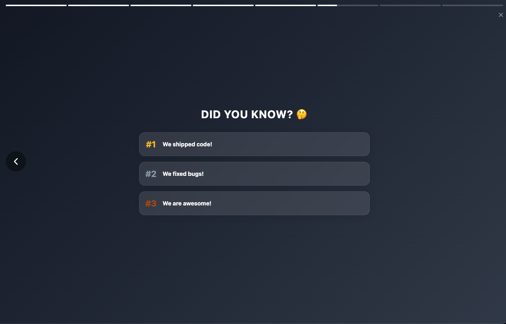

# Azure DevOps Year-in-Review Extension

Generate a year-in-review (Azure DevOps wrapped) style presentation for any selected year in your Azure DevOps organization, highlighting repository, work, and pipeline outcomes, to help you celebrate success! 🍾 🎉🥂

## Slide deck
- Repos Activity — Commits, lines, contributors and repo highlights for the year.

- Pull Requests — PR volume, merge trends, and review cadence.

- Boards & Work Items — Work item statistics, bugs, and status distribution.

- Pipelines — Build/release runs, success rates, and duration insights.

- Wiki — Most popular pages distribution.

- Achievements & Fun — Total number of actions and fun slides.

- Thank You — A closing slide to appreciate the team's efforts.

## How it works
1. Install the extension in your Azure DevOps organization.
2. Open the Year-in-Review hub under boards, pick the target year & the desired slides, and generate the slide deck. (Slides that have no content will be skipped)
3. Enjoy the presentation of your team's yearly accomplishments! 🍾🎉🥂
